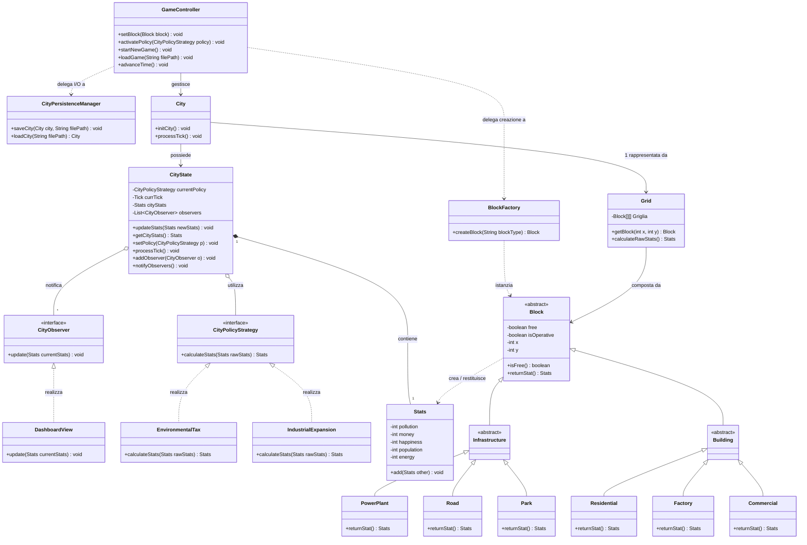

```mermaid
classDiagram
    direction TB

    %% ==========================================
    %% 1. DEFINIZIONE CLASSI E INTERFACCE
    %% ==========================================

    class GameController {
        +setBlock(Block block) void
        +activatePolicy(CityPolicyStrategy policy) void
        +startNewGame() void
        +loadGame(String filePath) void
        +advanceTime() void
    }

    class BlockFactory {
        +createBlock(String blockType) Block
    }

    class CityPersistenceManager {
        +saveCity(City city, String filePath) void
        +loadCity(String filePath) City
    }

    class CityObserver {
        <<interface>>
        +update(Stats currentStats) void
    }

    class DashboardView {
        +update(Stats currentStats) void
    }

    class City {
        +initCity() void
        +processTick() void
    }
    
    class CityState {
        -CityPolicyStrategy currentPolicy
        -Tick currTick
        -Stats cityStats
        -List~CityObserver~ observers
        +updateStats(Stats newStats) void
        +getCityStats() Stats
        +setPolicy(CityPolicyStrategy p) void
        +processTick() void
        +addObserver(CityObserver o) void
        +notifyObservers() void
    }

    class CityPolicyStrategy {
        <<interface>>
        +calculateStats(Stats rawStats) Stats
    }

    class EnvironmentalTax {
        +calculateStats(Stats rawStats) Stats
    }

    class IndustrialExpansion {
        +calculateStats(Stats rawStats) Stats
    }

    class Grid {
        -Block[][] Griglia
        +getBlock(int x, int y) Block
        +calculateRawStats() Stats
    }

    class Block {
        <<abstract>>
        -boolean free
        -boolean isOperative
        -int x
        -int y
        +isFree() boolean
        +returnStat() Stats
    }

    class Stats {
        -int pollution
        -int money
        -int happiness
        -int population
        -int energy
        +add(Stats other) void
    }

    class Infrastructure {
        <<abstract>>
    }
    
    class Building {
        <<abstract>>
    }

    class PowerPlant {
        +returnStat() Stats
    }
    
    class Road {
        +returnStat() Stats
    }
    
    class Park {
        +returnStat() Stats
    }

    class Residential {
        +returnStat() Stats
    }
    
    class Factory {
        +returnStat() Stats
    }
    
    class Commercial {
        +returnStat() Stats
    }

    %% ==========================================
    %% 2. RELAZIONI, ASSOCIAZIONI ED EREDITARIETÀ
    %% ==========================================

    GameController --> City : gestisce
    
    %% Relazioni Pattern e Gestori Esterni
    GameController ..> BlockFactory : delega creazione a
    GameController ..> CityPersistenceManager : delega I/O a
    BlockFactory ..> Block : istanzia

    City --> CityState : possiede
    City --> Grid : 1 rappresentata da
    Grid --> Block : composta da
    
    %% Observer Pattern
    CityObserver <|.. DashboardView : realizza
    CityState o-- "*" CityObserver : notifica
    
    %% CityState possiede le statistiche attuali della città
    CityState "1" *-- "1" Stats : contiene

    %% Block crea le statistiche per il calcolo del delta
    Block ..> Stats : crea / restituisce

    CityState o-- CityPolicyStrategy : utilizza
    CityPolicyStrategy <|.. EnvironmentalTax : realizza
    CityPolicyStrategy <|.. IndustrialExpansion : realizza

    Block <|-- Infrastructure
    Block <|-- Building

    Infrastructure <|-- PowerPlant
    Infrastructure <|-- Road
    Infrastructure <|-- Park

    Building <|-- Residential
    Building <|-- Factory
    Building <|-- Commercial
```
