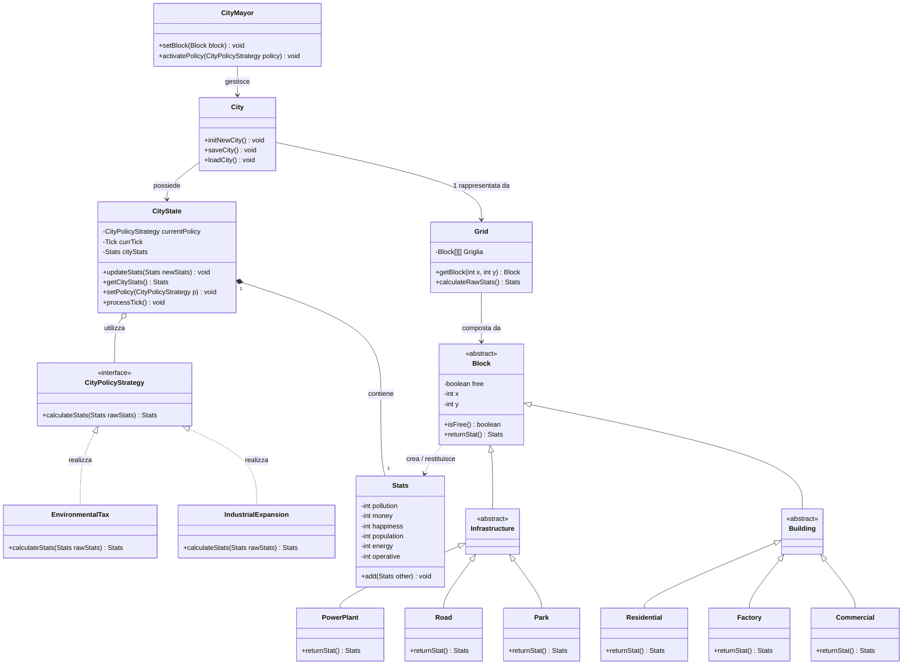

```mermaid
classDiagram
    direction TB

    %% ==========================================
    %% 1. DEFINIZIONE CLASSI E INTERFACCE
    %% ==========================================

    class CityMayor {
        +setBlock(Block block) void
        +activatePolicy(CityPolicyStrategy policy) void
    }

    class City {
        +initNewCity() void
        %% Metodi futuri per l'I/O previsti dalle specifiche
        +saveCity() void
        +loadCity() void
    }

    class CityState {
        -CityPolicyStrategy currentPolicy
        -Tick currTick
        -Stats cityStats
        +updateStats(Stats newStats) void
        +getCityStats() Stats
        +setPolicy(CityPolicyStrategy p) void
        +processTick() void
    }

    class CityPolicyStrategy {
        <<interface>>
        +calculateStats(Stats rawStats) Stats
    }

    class EnvironmentalTax {
        +calculateStats(Stats rawStats) Stats
    }

    class IndustrialExpansion {
        +calculateStats(Stats rawStats) Stats
    }

    class Grid {
        -Block[][] Griglia
        +getBlock(int x, int y) Block
        +calculateRawStats() Stats
    }

    class Block {
        <<abstract>>
        -boolean free
        -int x
        -int y
        +isFree() boolean
        +returnStat() Stats
    }

    class Stats {
        -int pollution
        -int money
        -int happiness
        -int population
        -int energy
        -int operative
        +add(Stats other) void
    }

    class Infrastructure {
        <<abstract>>
    }
    
    class Building {
        <<abstract>>
    }

    class PowerPlant {
        +returnStat() Stats
    }
    
    class Road {
        +returnStat() Stats
    }
    
    class Park {
        +returnStat() Stats
    }

    class Residential {
        +returnStat() Stats
    }
    
    class Factory {
        +returnStat() Stats
    }
    
    class Commercial {
        +returnStat() Stats
    }

    %% ==========================================
    %% 2. RELAZIONI, ASSOCIAZIONI ED EREDITARIETÀ
    %% ==========================================

    CityMayor --> City : gestisce
    City --> CityState : possiede
    City --> Grid : 1 rappresentata da
    Grid --> Block : composta da
    
    %% CityState possiede le statistiche attuali della città
    CityState "1" *-- "1" Stats : contiene

    %% Block crea le statistiche per il calcolo del delta
    Block ..> Stats : crea / restituisce

    CityState o-- CityPolicyStrategy : utilizza
    CityPolicyStrategy <|.. EnvironmentalTax : realizza
    CityPolicyStrategy <|.. IndustrialExpansion : realizza

    Block <|-- Infrastructure
    Block <|-- Building

    Infrastructure <|-- PowerPlant
    Infrastructure <|-- Road
    Infrastructure <|-- Park

    Building <|-- Residential
    Building <|-- Factory
    Building <|-- Commercial
```
